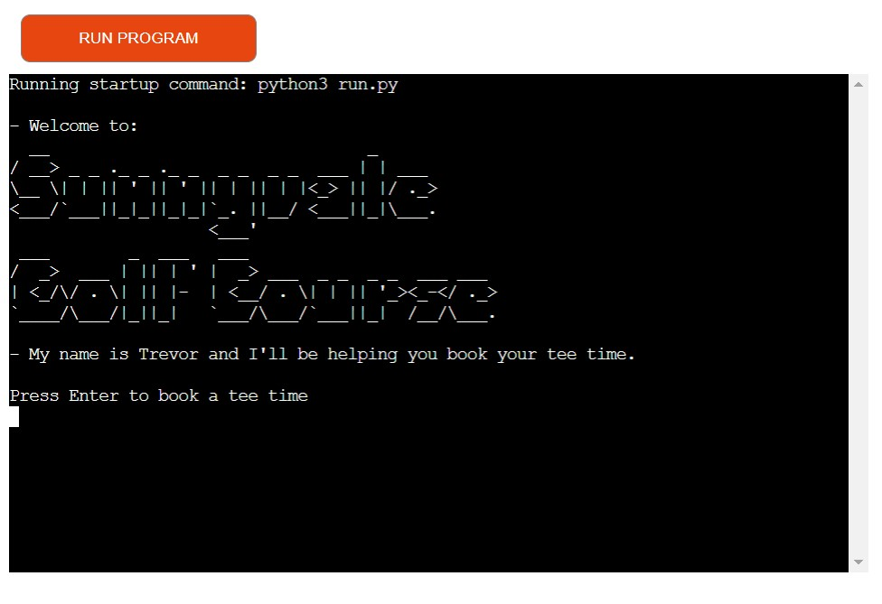
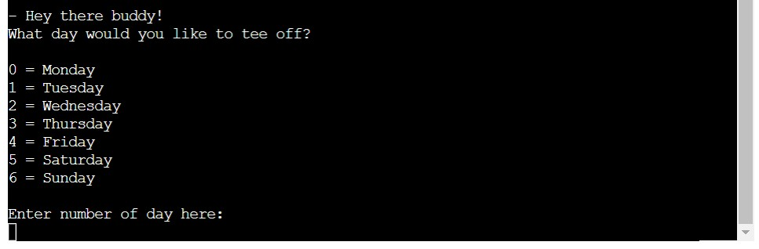
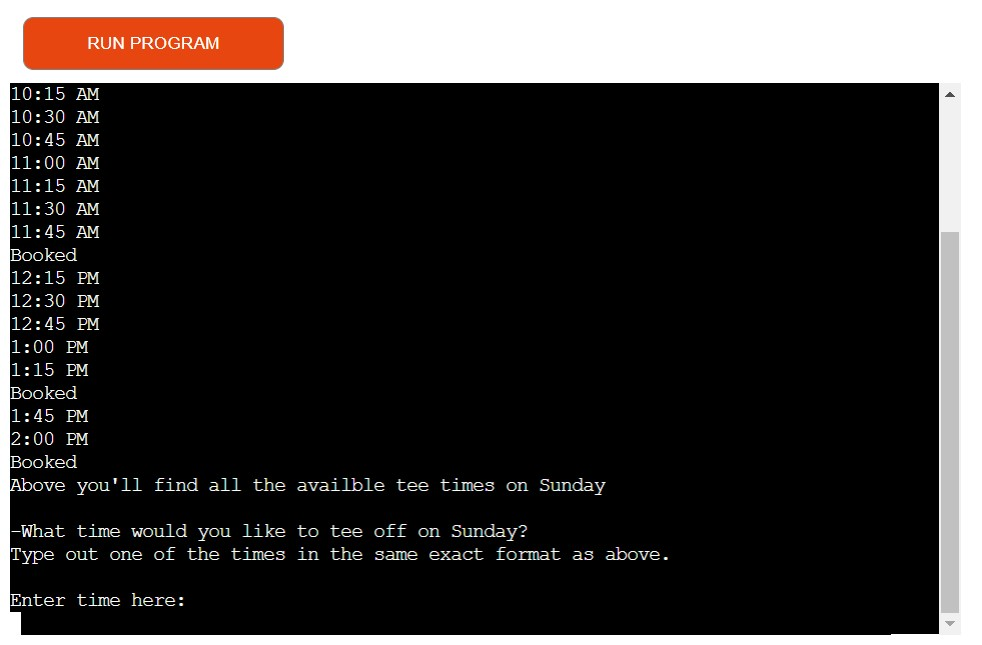
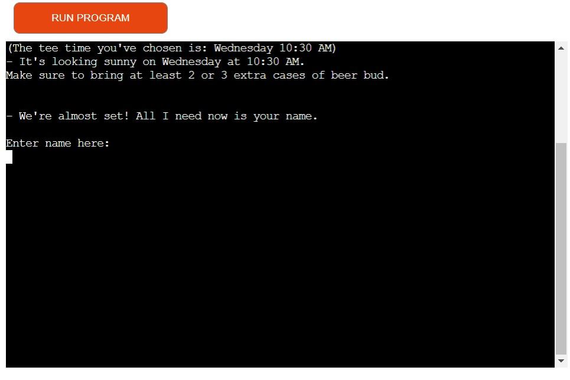
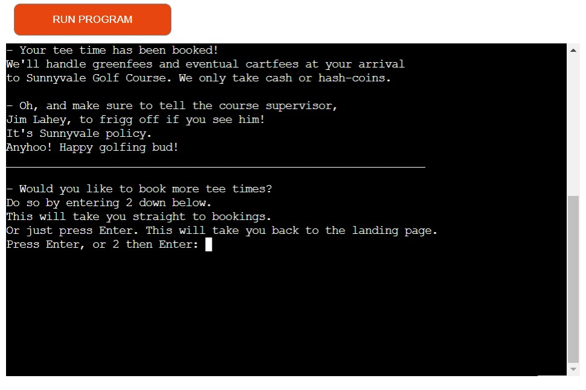
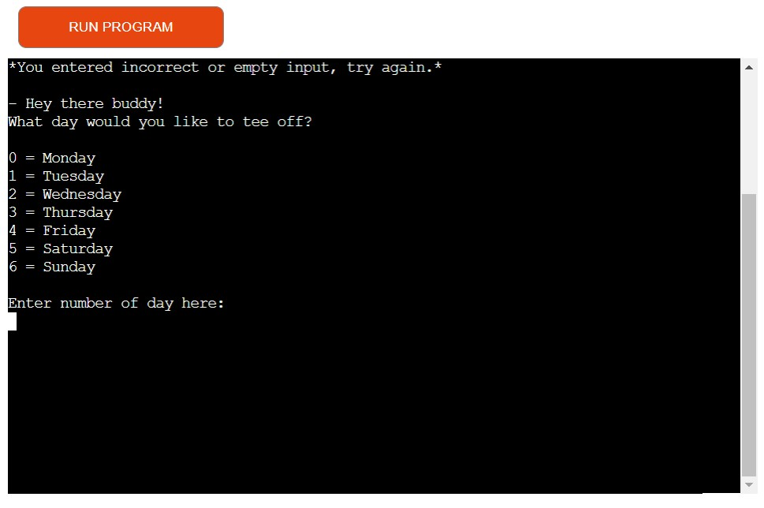

# Sunnyvale Golf Course bookings


[Link to the deployed project](https://sunnyvale-golf-course.herokuapp.com/)

[Visit repository here](https://github.com/alexanderglemme/sunnyvale-golf-pp3)

## Brief description of the projects background and main needs
Sunnyvale Golf Course is a fictional golf course inspired by the hit tv-show [Trailer Park Boys](https://en.wikipedia.org/wiki/Trailer_Park_Boys). The idea behind the app is that a character from the show (Trevor) har started working on the golf course (thus explaining his abscense in the show) and needs an easy-to-use booking system so that he can't mess things up in the google sheets whenever a guest calls him on the job. Since this character isn't exactly the sharpest tool in the shed, he also needs the booking system to actually tell him what to say to the guest who's on the phone trying to book a tee time, hence the prompts printed before and after the user inputs. Despite this a guest could also use the app if needed because of the very simple and easy to use nature of the app.

# Features
## Landing screen
The landing screen features neat ASCII art of the golf courses logo, and instructions for how to start booking a tee time.


## Start booking
When the user has pressed enter to start booking, the program will ask the user what day they want to book a tee time. The reason behind there only being one week available to book tee times on is so that tee times don't get swamped way ahead of time, many real life golf courses do the same during times of high demand.


## Choose time
After the user has selected what day he wants to place a booking, the program will show all the available tee times that day.


## Last step
After te user successfully enters a tee time, the program will confirm to the user which tee time he/she has chosen, and also make sure that the user knows what weather it will be on the course that day during that tee time and what to do about it, then asks for a name to book in.


## After booking has been placed
After a name has been entered the program will:
1. Update the worksheets 'Tee Times' and 'Names' associated to the program by changing the particular cells of the booked tee times.
2. Show a prompt indicating that the booking has been made and show vital information about the visit.
3. It then gives the user the option to either head back to the landing, which will come in handy when the booking system gets updated with more actions, or to go straight to start booking again.


## How the program handles invalid input
If blank or incorrect user input is entered the program will show a message telling the user what he/she did wrong and go back to start booking.


# Testing and bugs

## Code Validation
- Though pylint shows many problems, it seems as if none of them are vital to the program itself.

## Bugs
If a user enters text in the start booking input-field, the app throws an error and stops running.
This is not fixed.

## The deployed heroku app
The deployed heroku app has been tested via my own machine in a Chrome browser and works. 

# Structure
The structure of the app relies on user input that gets added into this [google sheets document](https://docs.google.com/spreadsheets/d/1XjO29yE69ECUXRAFkfb5cKHUQ6wUy0s4EyHIYpCQsUc/edit#gid=1516004422) when entered. All preexisting data in the gspread needs to be manually added as of now, this could be updated later.

# Forking the GitHub Repository
## To make a clone, or 'Fork' this repository, follow the steps below.

1. Access your GitHub account and find the relevant repository.
2. Click on 'Fork' on the top right of the page.
3. You will find a copy of the repository in your own Github account.
4. Making a Local Clone
5. Access your GitHub account and find the relevant repository.
6. Click the 'Code' button next to 'Add file'.
7. To clone the repository using HTTPS, under clone with HTTPS, copy the link.
8. Open Git Bash.
9. Access the directory you want the clone to be have.
10. In your IDE's terminal type 'git clone' and the paste the URL you copied.
11. Press Enter.
12. You now have a local clone.

# Deployment
## Heroku
### This application has been deployed from Github using Heroku. Here's how:

1. Create an account at heroku.com
2. Create a new app, add app name and your region
3. Click on create app
4. Go to "Settings"
5. Under Config Vars, add your sensitive data (creds.json for example)
6. For this project, I set buildpacks to and in that order.
7. Go to "Deploy" and at "Deployment method", click on "Connect to Github"
8. Enter your repository name and click on it when it shows below
9. Choose the branch you want to buid your app from
10. If desired, click on "Enable Automatic Deploys", which keeps the app up to date with your Github repository

## Google API
### Here's how you can set up your own API:

1. Login or create a Google account and navigate to https://console.cloud.google.com/
2. Create a new Project by clicking on the New Project icon
3. Add Project name and details
4. Under API's and services, enable the relevant API for your project (in this case Google Drive and Sheets)
5. If the API requires, create a credential (service account in this case) for your project
6. Download the credential and upload it to your workspace a a json-file
7. Under API's and services, enable the relevant API for your project (in this case Google Drive, Sheets and Calendar)
8. Search for the needed tasks to be performed in the documentation for the specific API.
9. Add them to your code.

# Credits
## Code
My code has been influenced by Code Institute's [love-sandwiches walkthrough project](https://github.com/AJGreaves/love-sandwiches).
The specific snippet of code that has been heavily influenced by love-sandwiches is:
```
import gspread
from google.oauth2.service_account import Credentials


SCOPE = [
    "https://www.googleapis.com/auth/spreadsheets",
    "https://www.googleapis.com/auth/drive.file",
    "https://www.googleapis.com/auth/drive"
    ]

CREDS = Credentials.from_service_account_file('creds.json')
SCOPED_CREDS = CREDS.with_scopes(SCOPE)
GSPREAD_CLIENT = gspread.authorize(SCOPED_CREDS)
SHEET = GSPREAD_CLIENT.open('sunnyvale_golfcourse')

all_tee_times = SHEET.worksheet('Tee Times').get_values()
weather = SHEET.worksheet('Weather').get_values()
```

I've also turned to [this thread on stackoverflow](https://stackoverflow.com/questions/59497109/is-there-a-python-3-command-to-clear-the-output-console), and more specifically the code which I've borrowed is:
```
def clear():
    """
    Function that clears the terminal when called to reduce clutter.
    """
    os.system('cls')  # on Windows System
    os.system('clear')  # on Linux System
```
... and comes from the user "HariKishore" in mentioned thread.

## ASCII art
The website i used to generate the landing screen's ASCII art is [this one](https://patorjk.com/software/taag/#p=display&f=Dr%20Pepper&t=Sunnyvale%20Golf%20Course)

## Some README.md content
The readme content explaining how to fork and deploy was borrowed from [johnvenkiah's pp3 readme](https://github.com/johnvenkiah/CI_PP3_John_Venkiah#readme).


